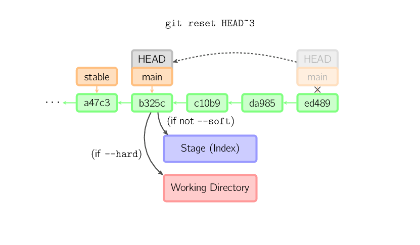

# git 公式サイト
[https://git-scm.com/](https://git-scm.com/)


# git cheat sheet


# git 工作原理

```
・Remote：远程仓库，托管代码的服务器
・Repository：仓库区（或版本库），其中HEAD指向最新放入仓库的版本
・Index／Stage：暂存区（或索引区），用于临时存放你的改动，事实上它只是一个文件，保存即将提交到文件列表信息
・Workspace：工作区，就是你平时存放项目代码的地方
```
#### 具体例：下图中的四条命令在「工作区」、「暂存区」、「仓库区」之间复制文件。

```
・(提交) git add files： 把当前文件放入暂存区域。
・(提交) git commit： 给暂存区域生成快照并提交。
・(取出) git reset -- files： 用来撤销最后一次git add files，你也可以用git reset 撤销所有暂存区域文件。
・(取出) git checkout -- files： 把文件从暂存区域复制到工作目录，用来丢弃本地修改。
```
 #### 也可以跳过「暂存区」直接从「仓库区」取出文件或者直接提交代码。

```
・(提交) git commit -a： 相当于运行 git add 把工作区下的所有文件加入「暂存区」再运行git commit.
・(取出) git checkout HEAD -- files： 回滚到复制最后一次提交。
```


# git 常用命令

> git設定
<details>
<summary>git config</summary>

|<div style="width:290px">コマンド</div>|説明|
|---|---|
|`git --version`                          |gitバージョンを表示|
|`git config --list`                      |設定一覧を表示|
|`git config --global user.name <name>`   |コミット操作に付加されるあなたの<font color="Blue">名前</font>を設定|
|`git config --global user.email <email>` |コミット操作に付加されるあなたの<font color="Blue">メールアドレス</font>を設定|
|`git config --global color.ui auto`      |デフォルトでは color.ui は auto に設定|
|`git config --global alias.<alias-name> <git-command>`<br>例：<br>&nbsp;git config --global alias.co checkout<br>&nbsp;git config --global alias.br branch<br>&nbsp;git config --global alias.ci commit<br>&nbsp;git config --global alias.st status<br>  |コマンドのショットキー、configファイルは下記のように<br>[alias]<br>&nbsp;co = checkout<br>&nbsp;br = branch<br>&nbsp;ci = commit<br>&nbsp;st = status|
|`--local`                                |ローカルの構成ファイル<br>個別Gitリポジトリ <font color="Blue">.git/config</font>に保存される|
|`--global`                               |ユーザーレベルの構成ファイル、ユーザホームに保存される<br>・UNIXの場合は <font color="Blue">~/.gitconfig</font>に保存される<br>・Windowsの場合は <font color="Blue">C:\Users\<ユーザー名>\.gitconfig</font>に保存される|
|`--system`                               |システムレベルの構成ファイル<br>・UNIXの場合は <font color="Blue">/etc/gitconfig</font>に保存される<br>・Windowsの場合は <font color="Blue">C:\ProgramData\Git\config</font>に保存される|
</details>

<details>
<summary>.gitignore</summary>

ホームディレクトリで構わないので、ファイルは自分で作成する必要がある。<br>`git config --global core.excludesFile ~/.gitignore` 場所指定
|パターン|一致する例|説明|
|---|---|---|
|`*.log`                  |debug.log<br>logs/debug.log                       |アスタリスクは、0 個以上の文字に一致するワイルドカードです|
|`*.log  !important.log`  |debug.log<br>but no<br>important.log              |感嘆符をパターンの先頭に追加すると、パターンを否定します。ファイルが、あるパターンと一致するが、ファイルの後半で定義済みの否定パターンとも一致する場合、そのファイルは無視されません|
|`debug?.log`             |debug0.log<br>debugg.log<br>but not<br>debug10.log|疑問符は正確に 1 文字に一致します|
|`debug[0-9].log`         |debug0.log<br>debug1.log<br>but not<br>debug10.log|角括弧を使用して、指定した範囲の 1 文字を照合することもできます|
|`debug[a-z].log`         |debuga.log<br>debugb.log<br>but not<br>debug1.log |範囲は数値またはアルファベットです|
</details>


> リポジトリの作成
<details>
<summary>git init</summary>

|<div style="width:290px">コマンド</div>|説明|
|---|---|
|`git init`                               |現在のディレクトリをリポジトリに変換、.git サブディレクトリが追加される|
|`git init <directory>`                   |指定したディレクトリにリポジトリを作成、.git サブディレクトリが追加される|
|`git init --bare`                        |<font color="Blue">ベアリポジトリ</font>、ファイルを持たないリポジトリを作成、ファイルの編集や変更はできない|
|`git init --template=<template>`         |＜template＞からファイルをコピーし、新しい Gitリポジトリを作成|
</details>

<details>
<summary>git clone</summary>

|<div style="width:500px">コマンド</div>|説明|
|---|---|
|`git clone <repo>`                       |現在のディレクトリでリポジトリをコピー作成|
|`git clone <repo> <directory>`           |指定したローカルディレクトリでリポジトリをコピー作成|
|`git clone --branch <branch> <repo>`     |リモートの HEADが指すブランチ(通常は mainブランチ)の代わりに、特定のブランチを指定|
|`git clone --branch <tag> <repo>`        |特定のタグを指定しても同じ操作が可能|
|`git clone --bare`                       |git init --bareと同様にベアリポジトリとなり、ファイルの実態が持たない|
|`git clone --template=<template> <repo>` |リポジトリをクローンして、指定した＜template＞のテンプレートを適用|
</details>


> 変更の作成
<details>
<summary>git status</summary>

|コマンド|説明|
|---|---|
|`git status`                 |コミット済みの履歴情報は含まれないため、git logを使う必要がある|
|`git status -s`              |例：<br>?? xxxx.txt　# ??= Untracked<br>A xxxx.txt　# A= added<br>M xxxx.txt　# M= Modified<br>コミットされると表示されなくなる|
</details>

<details>
<summary>git diff</summary>


|コマンド|説明|
|---|---|
|`git diff`                          |まだステージされていないファイルの差分を表示します|
|`git diff --staged`                 |ステージングと最後のファイルバージョンとの差分を表示します|
|`git diff --cached`                 |git addした後に、インデックスと最新のコミットとの変更点|
|`git diff HEAD^`                    |git commitした後に、コミットした箇所を表示、最新のコミットと最新のコミットのひとつ前の差分|
|`git diff HEAD..origin/ブランチ名`   |git pullする前に、ローカルの最新コミットと pull先のリモートリポジトリとの変更点|
|`git diff origin/ブランチ名..HEAD`   |git pushする前に、git commitした後にリモートリポジトリとこれから push したい箇所の変更点|
|`git diff ブランチA..ブランチB`      |ブランチ同士を比較する、Pull Requestを送る前に、自分が作ったブランチとマスタとの変更点|
</details>

<details>
<summary>git add</summary>

|コマンド|説明|
|---|---|
|`git add .`                  |すべての変更をステージして次回のコミット対象|
|`git add <file>`             |指定したファイルの変更をステージして次回のコミット対象|
|`git add -f <file>`          |無視されたファイルを強制的にコミット対象にする|
</details>

<details>
<summary>git reset</summary>


###### reset命令把当前分支指向另一个位置，并且有选择的变动工作目录和索引。也用来在从历史仓库中复制文件到索引，而不动工作目录。

###### 如果没有给出提交点的版本号，那么默认用HEAD。这样，分支指向不变，但是索引会回滚到最后一次提交，如果用--hard选项，工作目录也同样。
|コマンド|説明|
|---|---|
|`git reset`              |ファイルをステージングから外しますが、その内容は保持します|
</details>

<details>
<summary>git commit</summary>


###### 图中，当前分支是main。 在运行命令之前，main指向ed489，提交后，main指向新的节点f0cec

###### 想更改一次提交，使用 git commit --amend。git会使用与当前提交相同的父节点进行一次新提交，旧的提交会被取消
|コマンド|説明|
|---|---|
|`git commit -m "<message>" ` |テキストエディターは起動せず、ステージされたスナップショットを即座コミット|
|`git commit -a`              |作業ディレクトリにおけるすべての変更のスナップショットをコミット|
|`git commit -am "<message>" `|-a と -m を組み合わせたコマンド。この組み合わせではすべての変更をコミット|
|`git commit --amend`         |新しいコミットを作成する代わりに、ステージした変更が直前のコミットに追加される|
</details>
---


<details>
<summary>git log</summary>

|コマンド|説明|
|---|---|
|`git log`                       |コミット済みのスナップショットを表示|
|`git log -n <limit>`            |git log -n 3 表示するコミット数は 3|
|`git log --oneline`             |各コミットを 1 行にまとめる|
|`git log --stat`                |通常の git log 情報に加えて、改変されたファイルおよびその中での追加行数と削除行数を増減数で表示|
|`git log -p`                    |各コミットを表すパッチを表示、各コミットの完全な差分を表示。プロジェクト履歴で取得可能な最も詳細なビュー|
|`git log --author= <pattern>`   |Search for commits by a particular author.|
|`git log --grep=<pattern>`      |Search for commits with a commit message that matches <pattern>.|
|`git log <since>..<until>`      |Show commits that occur between <since> and <until>. Args can be a commit ID, branch name, HEAD, or any other kind of revision reference.|
|`git log -- <file>`             |指定されたファイルを含むコミットのみを表示|
|`git log --follow [file]        |名前の変更を含む指定したファイルのバージョン履歴の一覧を表示します|
|`git log --graph --decorate`    |--graph フラグを指定すると、コミットメッセージの左側にテキストベースのコミットの図が描画される<br>--decorate はブランチの名前または表示されるコミットのタグを追加|
</details>
---


<details>
<summary>git rm</summary>

|コマンド|説明|
|---|---|
|`git rm <file>`              |ステージングと作業ディレクトリから物理削除、コミットされるまでgit reset HEADで取り消せる|
|`git rm --cached <file>`     |リポジトリから論理削除、作業ディレクトリに実ファイルは残る|
</details>


<details>
<summary>git branch/git tag</summary>

|コマンド|説明|
|---|---|
|`git branch`                      |ローカルリポジトリ内のブランチを一覧表示|
|`git branch -r`                   |リモートリポジトリ内のブランチを一覧表示|
|`git branch -a`                   |すべてのブランチを一覧表示|
|`git branch <branch>`             |新規ブランチを作成、作成された新規ブランチはチェックアウトされない|
|`git branch -d <branch>`          |指定したブランチを削除|
|`git branch -D <branch>`          |指定したブランチにマージされていない変更が残っていたとしても強制削除|
|`git branch -m <branch>`          |現在のブランチの名前を<branch>に変更|
|`git tag`                         |タグ一覧|
|`git tag -a <tag>`                |指定した新しい注釈付きタグを作成|
|`git tag -a <tag> -m "<message>"` |指定した新しい注釈付きタグを即座に作成|
|`git tag -d <tag>`                |指定したタグを削除|
|`git show <tag>`                  |指定したタグの内容を表示|
</details>


<details>
<summary>git checkout</summary>


###### ブランチの作成、ブランチの切り替え、リモート・ブランチのチェックアウトに使用
|コマンド|説明|
|---|---|
|`git checkout -b <branch>`   |ブランチを新規作成&チェックアウト|
|`git checkout <branch>`      |指定ブランチをチェックアウト|
|`git checkout <tag>`         |指定タグをチェックアウト|
|`git checkout .`             |最新チェックアウト|
</details>
---


<details>
<summary>git merge</summary>

|コマンド|説明|
|---|---|
|`git merge ＜branch＞`    |指定した <branch> を現在のブランチにマージ|
|`git merge origin/master` |指定した リモートmasterブランチ を現在のブランチにマージ|
</details>
---


<details>
<summary>git remote</summary>

git clone コマンドを使用してリポジトリをクローンすると、クローンされたリポジトリをポイントバックする origin という名称のリモート接続が自動的に作成<br>
.git/config ファイルを直接編集することもできる
|コマンド|説明|
|---|---|
|`git remote -v`                          |リモート接続の一覧を表示| 
|`git remote add <name> <url>`            |リモートリポジトリへの接続を追加| 
|`git remote rm <name>`                   |リモートリポジトリへの接続を削除|
|`git remote rename <old-name> <new-name>`|リモート接続名称変更|
</details>


<details>
<summary>git fetch</summary>

リモートコンテンツがダウンロードされるが、git mergeが実行されず、ローカルリポジトリの作業状態は更新されない
|コマンド|説明|
|---|---|
|`git fetch <remote>`                     |リモートリポジトリからフェッチ、統合せず|
|`git fetch <remote> <branch>`            |特定ブランチと同期する<br>例：`git fetch origin HEAD`|
|`git fetch --all`                        |登録されたリモートとブランチをすべてフェッチする|
</details>


<details>
<summary>git pull</summary>

リモートコンテンツがダウンロードされ、すぐにgit mergeが実行され、新しいリモートコンテンツのマージコミットが作成<br>
--rebase オプションは、不要なマージ コミットを防止することによって直線的な履歴を確保するために使用できます。<br>
多くの開発者はマージよりもリベースを優先します。これは、「他のすべての人が行った変更の上に自分の変更を加えたい」<br>
`git config --global branch.autosetuprebase always` 実行すると、すべての git pull コマンドで統合の際に git rebase が使用される
|コマンド|説明|
|---|---|
|`git pull <remote>`                      |指定したリモートにおけるコピーをフェッチして、それをローカルのコピーに即時マージ|
|`git pull`                               |git fetch origin HEAD および git merge HEAD に相当|
|`git pull --rebase origin`               |プルと同じく、git mergeを使用してリモート ブランチをローカル ブランチと統合するのではなく、git rebaseを使用|
</details>


<details>
<summary>git push</summary>

|コマンド|説明|
|---|---|
|`git push <remote> <branch>`             |Push the branch to <remote>, along with necessary commits and objects. Creates named branch in the remote repo if it doesn’t exist.
|`git push <remote> --force`              |Forces the git push even if it results in a non-fast-forward merge. Do not use the --force flag unless you’re absolutely sure you know what you’re doing. 
|`git push <remote> --all`                |Push all of your local branches to the specified remote.
|`git push <remote> --tags`               |Tags aren’t automatically pushed when you push a branch or use the --all flag. The --tags flag sends all of your local tags to the remote repo. 
|`git push origin master`                 |リモートブランチmasterにプッシュ|
|`git push origin <tag>`                  |ブランチと似ている。タグは明示的に渡す必要があり|
</details>
---


<details>
<summary>git 戻し</summary>


###### reset命令把当前分支指向另一个位置，并且有选择的变动工作目录和索引。也用来在从历史仓库中复制文件到索引，而不动工作目录。

###### 如果没有给出提交点的版本号，那么默认用HEAD。这样，分支指向不变，但是索引会回滚到最后一次提交，如果用--hard选项，工作目录也同样。
|コマンド|説明|
|---|---|
|`git reset`              |現在のコミットから後戻りする、プロジェクト履歴から削除するため、公開済み履歴の操作は厳禁|
|`git reset HEAD`         |現在コミットの1回分前に戻す|
|`git reset HEAD~2`       |現在コミットの2回分前に戻す、実質的には直近二つのスナップショットをプロジェクト履歴から削除する|
|`git revert`             |公開済みのコミットを訂正する場合のコマンド、履歴における任意の時点でのコミットをターゲットにできる、履歴として追加される形|
|`git rebase -i <base>`   |古いコミットや複数のコミットの変更、 直前のコミットを変更するには`git commit --amend`|
|`git reflog`             |ブランチの先端に対する更新を記録|
|`git clean -n`           |追跡対象外ファイルを操作します、作業ディレクトリの変更を元に戻す、削除する前に確認表示|
|`git clean -f`           |追跡対象外ファイルを操作します、作業ディレクトリの変更を元に戻す、強制削除|
</details>
---
